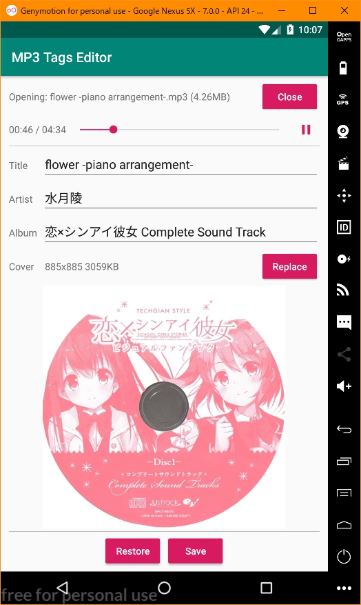

# MP3 Tags Editor

+ Edit mp3 file's ID3v2.3 tags in Android MVP

### Functions

+ [x] Read and write title, artist, album
+ [x] Load and write cover(jpg)
+ [ ] Support other tags
+ [ ] Convert video to mp3
+ [ ] Edit and save cover
+ [ ] Cut music

### Environments

+ `minSdkVersion` 24 (Android 7.0)
+ `targetSdkVersion` 28
+ `compileSdkVersion` 28

### Dependencies

+ [mp3agic](https://github.com/mpatric/mp3agic)
+ [MobileFFmpeg](https://github.com/tanersener/mobile-ffmpeg)

### Screenshot
 

### References

+ [cannot access Path class file for java.nio.file.Path not found](https://github.com/mpatric/mp3agic/issues/141)
+ [FFmpeg Android Java](http://writingminds.github.io/ffmpeg-android-java/)