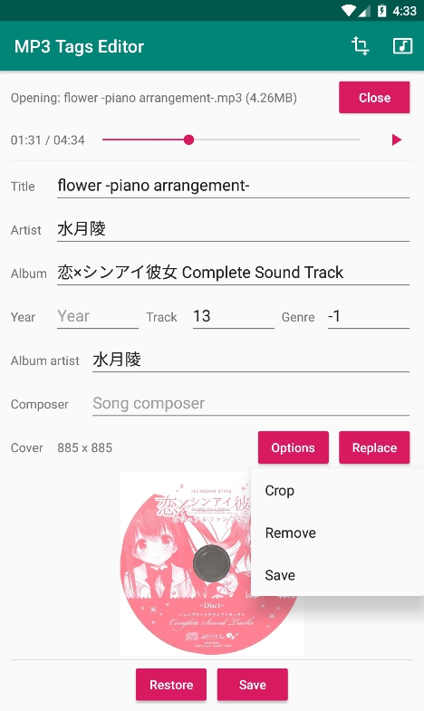
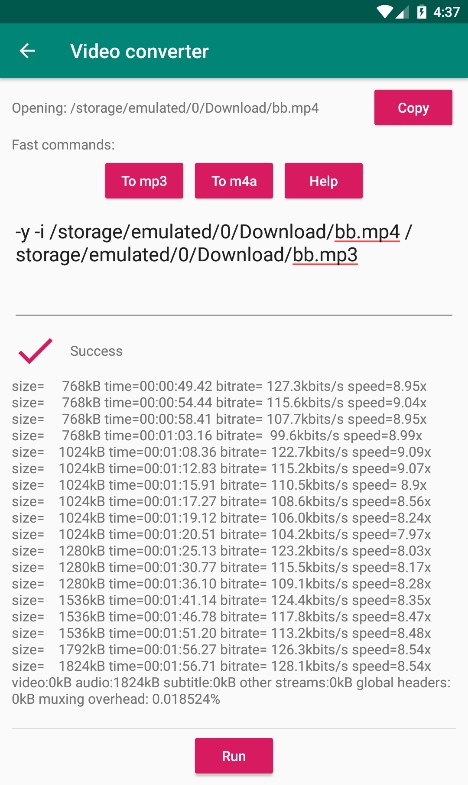

# MP3 Tags Editor

+ Edit mp3 file's ID3v2.3 tags in Android MVP

### Functions

+ [x] Support some of tags
+ [x] Load and write cover(jpg)
+ [x] Convert video to mp3
+ [x] Crop and save cover

### Environments

+ `minSdkVersion` 24 (Android 7.0)
+ `targetSdkVersion` 28
+ `compileSdkVersion` 28

### Dependencies

+ [mp3agic](https://github.com/mpatric/mp3agic)
+ [mobile-ffmpeg](https://github.com/tanersener/mobile-ffmpeg)
+ [android-image-cropper](https://github.com/ArthurHub/Android-Image-Cropper)

### Screenshots

### References

+ [cannot access Path class file for java.nio.file.Path not found](https://github.com/mpatric/mp3agic/issues/141)
+ [次のActivityにサイズの大きいBitmapを渡す方法](https://nvtrlab.jp/blog/penco/%E6%AC%A1%E3%81%AEactivity%E3%81%AB%E3%82%B5%E3%82%A4%E3%82%BA%E3%81%AE%E5%A4%A7%E3%81%8D%E3%81%84bitmap%E3%82%92%E6%B8%A1%E3%81%99.html)
